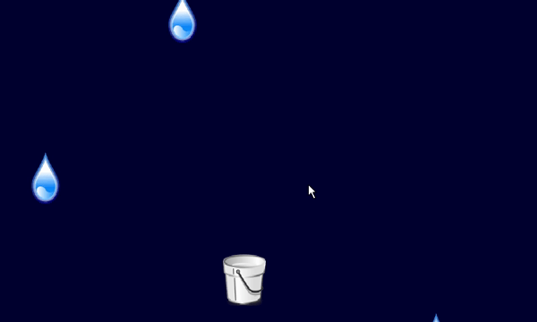
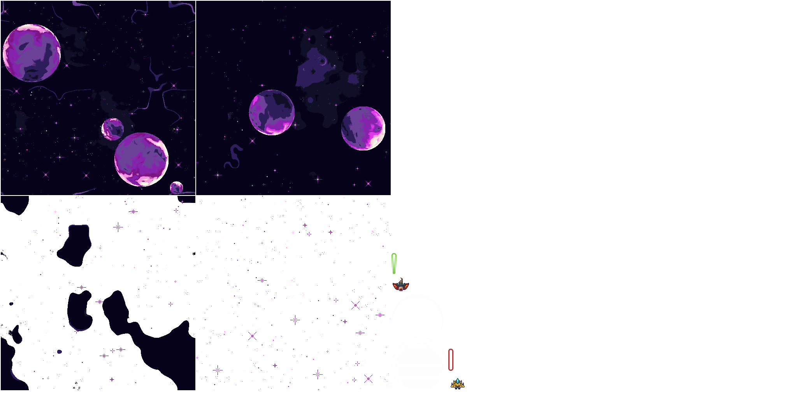

# Sandeep's-community-code


Video demo showing the game:


[](https://www.youtube.com/watch?v=lG93FRTdNes)

# Week 5

I chose the [libGDX](https://github.com/libgdx/libgdx) community for Java. libGDX is a Java game development framework. I decided on this community because I'm interested in game development. Hopefully, by using their library, I can either create a small game, help the community or add to an existing game.

## Raindrop tutorial game

I finished their raindrop tutorial game, and it was simple enough to get me to familiarize myself with their library. It taught me how to import different assets using their [Texture](https://libgdx.badlogicgames.com/ci/nightlies/docs/api/com/badlogic/gdx/graphics/Texture.html), [Sound](https://libgdx.badlogicgames.com/ci/nightlies/docs/api/com/badlogic/gdx/audio/Sound.html), and [Music](https://libgdx.badlogicgames.com/ci/nightlies/docs/api/com/badlogic/gdx/audio/Music.html) tools. Set up the game screen using their [Orthographic Camera](https://libgdx.badlogicgames.com/ci/nightlies/docs/api/com/badlogic/gdx/graphics/OrthographicCamera.html) tool and set up dimensions for the bucket using their [Rectangle](https://libgdx.badlogicgames.com/ci/nightlies/docs/api/com/badlogic/gdx/math/Rectangle.html) tool. Once that is all set up, using their [SpriteBatch](https://libgdx.badlogicgames.com/ci/nightlies/docs/api/com/badlogic/gdx/graphics/g2d/SpriteBatch.html) tool, I learned how to render the assets or draw them onto the screen to display. Also, for user input, they have a utility that finds the [touch position/mouse position relative to the screen and key inputs from the keyboard](https://libgdx.badlogicgames.com/ci/nightlies/docs/api/com/badlogic/gdx/Input.html). Then finally, dispose() of the assets after the game is closed.

For the tutorial, you can check out: <https://libgdx.com/wiki/start/a-simple-game>

Sample output after I have finished the tutorial:


## SpaceShooter Game

While searching for a project to learn coding with libGDX I found this great tutorial on [Youtube by Brandon Grasley](https://www.youtube.com/watch?v=DK1sGc4rOT4&list=PLfd-5Q3Fwq0WKrkEKw12nqpfER3MG5_Wi)

This tutorial is somewhat lengthy, but I learned a lot of the logic in moving assets around and creating a moving background. I'm going to stick with this tutorial in the coming weeks. Probably add different assets and maybe contribute more to the tutorial.

Sample output after finding out to create a parallax scrolling background:
.gif>)

## Week 6

I've finished the space shooter tutorial from last week and added different space ship and enemies also other styles of lasers. This game can still be improved, so I may add sound effects and maybe a boss after specific enemies are destroyed.

Code I changed/added different assets:

My texture atlas:

The Space background is generated by:  
<https://deep-fold.itch.io/space-background-generator>

The ships are from:  
<https://ansimuz.itch.io/patreons-top-down-collection>

And the lasers and shield are the same from the tutorial:  
<https://www.kenney.nl/assets/space-shooter-redux>

The reasoning behind the graphic changes are I wanted the game to look like a Super Nintendo game, to satiated my nostalgia



```Java
private TextureAtlas textureAtlas;
//code is still the same but I made a different "image.atlas" for the TextureAtlas
// A texture atlas basically is a collage of images into one file, saves memory and performance
 GameScreen() {
     //...
     textureAtlas = new TextureAtlas("images.atlas");

        // setting up the background
        backgrounds = new TextureRegion[4];
        backgrounds[0] = textureAtlas.findRegion("SpaceBackground");
        backgrounds[1] = textureAtlas.findRegion("SpaceBackground2");
        backgrounds[2] = textureAtlas.findRegion("SpaceBackground3");
        backgrounds[3] = textureAtlas.findRegion("SpaceBackground4");

        backgroundMaxScrollingSpeed = (float) (WORLD_HEIGHT) / 4;

        // initialize texture regions
        playerShipTextureRegion = textureAtlas.findRegion("playerShip1_red");
        enemyShipTextureRegion = textureAtlas.findRegion("enemyRed2");
        playerShieldTextureRegion = textureAtlas.findRegion("shield3");
        enemyShieldTextureRegion = textureAtlas.findRegion("shield1");
        enemyShieldTextureRegion.flip(false, true);
        playerLaserTextureRegion = textureAtlas.findRegion("laserGreen10");
        enemyLaserTextureRegion = textureAtlas.findRegion("laserRed14");
        enemyExplosion = new Texture(Gdx.files.internal("enemyexplosions.png"));
        playerExplosion = new Texture(Gdx.files.internal("playerexplosions.png"));

```

```Java
// This change is in the renderLasers method, The following comment block just describes the laser method from the the tutorial, For the code, I will show what I changed

    /**
     * renderLasers()
     * @param deltaTime
     * Method from rendering an array of lasers which takes the parameter delta time (time after each rendered frame or time between each frame)
     * Renders them depending on conditions:
     *  if playership can find laser -> add laser
     *  if enemyships can find laser -> add laser
     * Removes them on these conditions:
     *  playerlasers:
     *      if lasers y position is greater than the WORLD_HEIGHT (constant based on pixels) -> remove laser
     *  enemylasers:
     *      if lasers y position is less than the WORLD_HEIGHT - remove laser
     *  Also moves the lasers up for player and down for enemy bases on yposition, and movementspeed laser parameters and also the delta time
     */

    private void renderLasers(float deltaTime) {
        //...
        //
        iterator = enemyLaserList.listIterator();
        while (iterator.hasNext()) {
            Laser laser = iterator.next();

            /**
             * My Change:
             * Set the color of the enemy laser texure when rendered to yellow so it "pops out"
             * from the background without changing the texture atlas
             *
             * Then after the lasers are drawn, change the batch back to the original colors "white"
             * Causing only the lasers to have the yellow change
             */
            batch.setColor(Color.YELLOW);
            laser.draw(batch);
            batch.setColor(Color.WHITE);

            //end of change
            laser.boundingBox.y -= laser.movementSpeed * deltaTime;
            if (laser.boundingBox.y + laser.boundingBox.height < 0) {
                iterator.remove();
            }
        }
    }
```

```Java
/**
For the output of the lasers I did also added more lasers to the playership and just one laser for the enemy. To make it look like it's coming out for the silos on the player and the eye on the enemy.
*/

/**
Using paint as shown in the tutorial, I calculated the pixels percentage on each side for the playship to each silo and the eye for the enemyship
*/

class PlayerShip extends Ship{

   //...

   /**
   4 lasers for the playership
   */

    @Override
    public Laser[] firelaser() {
        Laser[] laser = new Laser[4];
        laser[0] = new Laser(boundingBox.x+boundingBox.width*0.72f, //float number is the percentage of the laser position
                            boundingBox.y+boundingBox.height*0.65f,
                            laserWidth, laserHeight,
                            laserMovementSpeed, laserTextureRegion);
        laser[1] = new Laser(boundingBox.x+boundingBox.width*0.80f,
                            boundingBox.y+boundingBox.height*0.31f,
                            laserWidth, laserHeight,
                            laserMovementSpeed, laserTextureRegion);
        laser[2] = new Laser(boundingBox.x+boundingBox.width*0.27f,
                            boundingBox.y+boundingBox.height*0.67f,
                            laserWidth, laserHeight,
                            laserMovementSpeed, laserTextureRegion);
        laser[3] = new Laser(boundingBox.x+boundingBox.width*0.14f,
                            boundingBox.y+boundingBox.height*0.33f,
                            laserWidth, laserHeight,
                            laserMovementSpeed, laserTextureRegion);
        timeSinceLastShot = 0;

        return laser;
    }

class EnemyShip extends Ship{

    //...

    /**
    Just one laser, still overrides the abstract firelaser method so I need a list I think.
    */
     @Override
    public Laser[] firelaser() {
        Laser[] laser = new Laser[1];
        laser[0] = new Laser(boundingBox.x+boundingBox.width*0.52f,
                            boundingBox.y+boundingBox.height*0.10f,
                            laserWidth, laserHeight,
                            laserMovementSpeed, laserTextureRegion);
        timeSinceLastShot = 0;

        return laser;
    }
```

```Java
/**
Last edit is the explosions, my png files where already one dimension I covert them into frames and stored them into an array. I got help from this video: https://youtu.be/1fJrhgc0RRw?t=211

Basically it goes to each section of the image and plays them in sequence.

Also I didn't hardcode any numbers, I used the getWidth and getHeight methods as my bounds for Texture so I can use the same code for different explosions.
*/

public class Explosion {

    private Animation<TextureRegion> explosionAnimation;
    private float explosionTimer;

    private Rectangle boundingBox;

    Explosion(Texture texture, Rectangle boundingBox, float totalAnimationTime) {
        this.boundingBox = boundingBox;
        int explosionSize = texture.getWidth()/texture.getHeight(); //Total number of frames for the array

        //Create a new texture region array that goes through each explosion and then add a frame to the corresponding array index
        Array<TextureRegion> frames = new Array<TextureRegion>();
        for (int i = 0; i < explosionSize; i++) {
            frames.add(new TextureRegion(texture,
                    i * texture.getHeight(),
                    0,
                    texture.getHeight(),
                    texture.getHeight()));
        }

        explosionAnimation = new Animation<TextureRegion>(totalAnimationTime/explosionSize, frames); //This creates the animation array for how long we want this animation to run / total frames, and the frame array
        explosionTimer = 0;
    }

```

Output:


## Week 7 & 8

OK, this was a challenging couple of weeks. I'm on my own, so to say, for the most part, meaning I'm not just following tutorials, lol, but I did implement the screens and fixed the playerShip when it explodes.

Where to start, let's see. First, I repositioned the ship off the screen when the ship is exploded, decremented the lives as usual, changed the playerShip's timeSinceLastShot variable to -3 so it stops shooting for 3 seconds and added a new boolean to called "playerDeath" that changes to true after the player dies.

```Java
/**
These are the changes I made in the detectCollisons method right after the "if (playerShip.hitAndCheckedDestroyed(laser))" line and after the explosion is added
*/
                    playerShip.translate(WORLD_WIDTH*2, WORLD_HEIGHT*2);
                    playerShip.lives--;
                    playerShip.timeSinceLastShot = -3;
                    playerDeath = true;

```

Then I created a new method called respawn, which checks if the boolean playerDeath = True AND if the time since the last shot is greater or equal to 0. Once those checks are satisfied, I move the ship back to where it was "relatively" by using the inverse of WORLD_WIDTH and WORLD_HEIGHT. Reset the shield to the default 10 and change the playerDeath back to false. Also, I forgot I initialized the playerDeath boolean in the GameScreen method.

```Java
private boolean playerDeath; //in game screen class, before the constructor

GameScreen(){
    //...
    playerDeath = false; //after the batch creation init the boolean as false
    //...
}

//new method for player respawn
private void respawn(){
        if (playerDeath == true && playerShip.timeSinceLastShot >= 0){
            playerShip.translate(-WORLD_WIDTH*2, -WORLD_HEIGHT*2);
            playerShip.shield = 10;
            playerDeath = false;
        }
    }

//and in the render method() added respawn() after the updateAndRenderHUD()

@Override
    public void render(float deltaTime) { // How much time since render cycle
    //...    
        updateAndRenderHUD();

        respawn();
    //...
```

Here's how it looks now when the player dies (ignore the pause button, for now, I will discuss it later)


As you can see, the player "disappears" when it dies, but it's moved out of bounds then repositioned backed. The repositioning is tricky, as the user can still technically move the ship off-screen, but it will slowly return to the screen. Further testing may be needed.

(I used the screen parameter times two so the player ship is far off-screen, making it challenging to return to the screen within 3 seconds)

I added new screens to the game, The Title Screen or Main Menu, and a pause screen. I still didn't add the game over or change the logic after the player lives are "depleted" (they still go to the negatives), but I wanted to show something for this week.

### GameStateManager

Okay, first, let me talk about this new class I made. I got help from this video: <https://youtu.be/eEV5iCTUD4k>
which show how to store each game screen in a Hash Table/Map so the game screens are still running in the background, but this manager will tell the app what screen to show

Here is the code:

```Java
package ca.dhaliwal.spaceshooter;

import java.util.HashMap;

import com.badlogic.gdx.Screen;

package ca.dhaliwal.spaceshooter;

import java.util.HashMap;

import com.badlogic.gdx.Screen;

public class GameStateManager {
    
    private final SpaceShooterGame game; //call the SpaceShooterGame application

    private HashMap<STATE, Screen> gameScreens = new HashMap<STATE, Screen>(); //store the game screens in a hash table for quick access

    public enum STATE{ //enum State refernced the game state
        MAIN_MENU, 
        PLAY,
        PAUSED
    }


    public GameStateManager(final SpaceShooterGame game){ //contructor for GSM with the SpaceShooterGame as it's parameter
        this.game = game; 

        initGameScreens(); // call the init game screens method
        setScreen(STATE.MAIN_MENU); //set the first screen for the SpaceShooterGame class to the title Screen
    }

    protected void initGameScreens(){ //method to initilize the game screens
         // initalized the Hash table to store each screen
        gameScreens.put(STATE.MAIN_MENU, new TitleScreen(game)); // main menu = TitleScreen class
        gameScreens.put(STATE.PLAY, new GameScreen()); // play = GameScreen
        gameScreens.put(STATE.PAUSED, new PauseScreen(game)); // Paused = PausedScreen
    }

    public void setScreen(STATE nextScreen){ //method to switch screens
        game.setScreen(gameScreens.get(nextScreen)); // will get the screen in the hash table and set it as the screen to display
    }

    public void removeScreen(STATE screen){ //method to remove screen, used for new game
        gameScreens.remove(screen); //remove screen from hash table
    }

    public void dispose(){ //dispose the screens as needed
        for (Screen screen: gameScreens.values()){
            if (screen != null){
                screen.dispose();
            }
        }
    }
}
```

### SpaceShooterGame

Then, Here are the changes for the main app (SpaceShooteGame) to initialize the screens and the GameStateManager.

``` Java
package ca.dhaliwal.spaceshooter;


import java.util.Random;

import com.badlogic.gdx.Game;


public class SpaceShooterGame extends Game{

 GameStateManager gsm;
 GameScreen gameScreen;
 TitleScreen titleScreen;
 PauseScreen pauseScreen;

 public static Random random = new Random();
 
 @Override
 public void create() {
  gameScreen = new GameScreen();
  titleScreen = new TitleScreen(this);
  pauseScreen = new PauseScreen(this);
  gsm = new GameStateManager(this);
 }

 @Override
 public void dispose() {
  // TODO Auto-generated method stub
  super.dispose();
 }

 @Override
 public void render() {
  // TODO Auto-generated method stub
  super.render();
 }
}
```

### Title Screen

I created a new class called Title Screen for the game. To summarize, I made a buttonstyle using the same font from (<https://somepx.itch.io/humble-fonts-free>) I used for the game screen; I Converted that font to a Bitmap font using <https://libgdx.com/wiki/tools/hiero>, and they created three buttons for new game(play), continue(resume) and exit(exit). I also used the height and width of the background from the game screen. To set up the buttons, I used the stage class and add actor method to add them into it. Stage is like texture batch, I think, I wanted to experiment using different tools. To get the button to work, I added a listener that calls the game state manager from the space shooter class and changes the screen. For the play button, I made it remove any old instance of the game screen, then reinitialized all the screens and changed the screen to the game screen.

The inputprocessor will only respond to the "clicks" for the show method when the screen is displayed.

```Java
package ca.dhaliwal.spaceshooter;

import com.badlogic.gdx.Gdx;
import com.badlogic.gdx.Screen;
import com.badlogic.gdx.graphics.Color;
import com.badlogic.gdx.graphics.g2d.BitmapFont;
import com.badlogic.gdx.scenes.scene2d.InputEvent;
import com.badlogic.gdx.scenes.scene2d.Stage;
import com.badlogic.gdx.scenes.scene2d.ui.TextButton;
import com.badlogic.gdx.scenes.scene2d.ui.TextButton.TextButtonStyle;
import com.badlogic.gdx.scenes.scene2d.utils.ClickListener;

import ca.dhaliwal.spaceshooter.GameStateManager.STATE;

public class TitleScreen implements Screen {
    private float screen_width = ((SpaceShooterGame) Gdx.app.getApplicationListener()).gameScreen.WORLD_WIDTH;
    private float screen_height = ((SpaceShooterGame) Gdx.app.getApplicationListener()).gameScreen.WORLD_HEIGHT;

    SpaceShooterGame game;
    Stage stage;
    BitmapFont font;

    public TitleScreen(SpaceShooterGame game) {
        this.game = game;

        stage = new Stage();
        font = new BitmapFont(Gdx.files.internal("FutileHero.fnt"));
        TextButtonStyle buttonStyle = new TextButtonStyle();
        buttonStyle.font = font;
        buttonStyle.fontColor = Color.WHITE;
        buttonStyle.downFontColor = Color.YELLOW;

        final TextButton playButton = new TextButton("NEW GAME", buttonStyle);
        final TextButton resumeButton = new TextButton("CONTINUE", buttonStyle);
        final TextButton exitButton = new TextButton("EXIT", buttonStyle);

        playButton.setWidth(screen_width / 4);
        playButton.setHeight(screen_height / 4);
        playButton.setPosition(screen_width / 4, screen_height / 1.5f);

        resumeButton.setWidth(screen_width / 4);
        resumeButton.setHeight(screen_height / 4);
        resumeButton.setPosition(screen_width / 4, screen_height / 2);

        exitButton.setWidth(screen_width / 4);
        exitButton.setHeight(screen_height / 4);
        exitButton.setPosition(screen_width / 4, screen_height / 3);

        playButton.addListener(new ClickListener() {
            @Override
            public void clicked(InputEvent event, float x, float y) {
                ((SpaceShooterGame) Gdx.app.getApplicationListener()).gsm.removeScreen(STATE.PLAY);
                ((SpaceShooterGame) Gdx.app.getApplicationListener()).gsm.initGameScreens();
                ((SpaceShooterGame) Gdx.app.getApplicationListener()).gsm.setScreen(STATE.PLAY);
            }
        });

        resumeButton.addListener(new ClickListener(){
            @Override
            public void clicked(InputEvent event, float x, float y) {
                ((SpaceShooterGame) Gdx.app.getApplicationListener()).gsm.setScreen(STATE.PLAY);
                
        }});

        exitButton.addListener(new ClickListener() {
            @Override
            public void clicked(InputEvent event, float x, float y) {
                Gdx.app.exit();
            }
        });

        stage.addActor(playButton);
        stage.addActor(resumeButton);
        stage.addActor(exitButton);

    }

    @Override
    public void render(float deltaTime) {
        ((SpaceShooterGame) Gdx.app.getApplicationListener()).gameScreen.batch.begin();
        ((SpaceShooterGame) Gdx.app.getApplicationListener()).gameScreen.renderBackground(deltaTime);
        ((SpaceShooterGame) Gdx.app.getApplicationListener()).gameScreen.batch.end();
        stage.draw();
    }

    @Override
    public void show() {
        Gdx.input.setInputProcessor(stage);
        
    }

    @Override
    public void resize(int width, int height) {
        stage.getViewport().update(width, height, true); // camera centered true

    }

    @Override
    public void pause() {
        // TODO Auto-generated method stub

    }

    @Override
    public void resume() {
        // TODO Auto-generated method stub

    }

    @Override
    public void hide() {
        // TODO Auto-generated method stub

    }

    @Override
    public void dispose() {
        // TODO Auto-generated method stub

    }
}
```

Output:

### PauseScreen

Pretty much the same logic is used for the pause screen. I need to clean this up because I'm repeating the code from the title screen.

```Java
package ca.dhaliwal.spaceshooter;

import com.badlogic.gdx.Gdx;
import com.badlogic.gdx.Screen;
import com.badlogic.gdx.graphics.Color;
import com.badlogic.gdx.graphics.g2d.BitmapFont;
import com.badlogic.gdx.scenes.scene2d.InputEvent;
import com.badlogic.gdx.scenes.scene2d.Stage;
import com.badlogic.gdx.scenes.scene2d.ui.TextButton;
import com.badlogic.gdx.scenes.scene2d.ui.TextButton.TextButtonStyle;
import com.badlogic.gdx.scenes.scene2d.utils.ClickListener;

import ca.dhaliwal.spaceshooter.GameStateManager.STATE;

public class PauseScreen implements Screen {
    SpaceShooterGame game;
    private float screen_width = ((SpaceShooterGame) Gdx.app.getApplicationListener()).gameScreen.WORLD_WIDTH;
    private float screen_height = ((SpaceShooterGame) Gdx.app.getApplicationListener()).gameScreen.WORLD_HEIGHT;
    Stage stage;
    BitmapFont font;
    protected PauseScreen(SpaceShooterGame game){
        stage = new Stage();
        font = new BitmapFont(Gdx.files.internal("FutileHero.fnt"));
        TextButtonStyle buttonStyle = new TextButtonStyle();
        buttonStyle.font = font;
        buttonStyle.fontColor = Color.WHITE;
        buttonStyle.downFontColor = Color.YELLOW;

        final TextButton mainMenuButton = new TextButton("Return To Main Menu", buttonStyle);
        final TextButton resumeButton = new TextButton("Resume", buttonStyle);

        resumeButton.setWidth(screen_width / 4);
        resumeButton.setHeight(screen_height / 4);
        resumeButton.setPosition(screen_width / 4, screen_height / 3);

        mainMenuButton.setWidth(screen_width / 4);
        mainMenuButton.setHeight(screen_height / 4);
        mainMenuButton.setPosition(screen_width / 4f, screen_height / 1.5f);

        resumeButton.addListener(new ClickListener(){
            @Override
            public void clicked(InputEvent event, float x, float y) {
                ((SpaceShooterGame) Gdx.app.getApplicationListener()).gsm.setScreen(STATE.PLAY);
                
        }});

        mainMenuButton.addListener(new ClickListener(){
            @Override
            public void clicked(InputEvent event, float x, float y) {
                ((SpaceShooterGame) Gdx.app.getApplicationListener()).gsm.setScreen(STATE.MAIN_MENU);
                
        }});

        stage.addActor(resumeButton);
        stage.addActor(mainMenuButton);
        
        
    }

    

    @Override
    public void show() {
        Gdx.input.setInputProcessor(stage);
        
    }

    @Override
    public void render(float deltaTime) {
        ((SpaceShooterGame) Gdx.app.getApplicationListener()).gameScreen.batch.begin();
        ((SpaceShooterGame) Gdx.app.getApplicationListener()).gameScreen.renderBackground(deltaTime);
        font.draw(((SpaceShooterGame) Gdx.app.getApplicationListener()).gameScreen.batch, "PAUSED", screen_width / 4f, screen_height /1.01f);
        ((SpaceShooterGame) Gdx.app.getApplicationListener()).gameScreen.batch.end();
        stage.draw();
    }

    @Override
    public void resize(int width, int height) {
        stage.getViewport().update(width, height, true); // camera centered true
        
    }

    @Override
    public void pause() {
        // TODO Auto-generated method stub
        
    }

    @Override
    public void resume() {
        // TODO Auto-generated method stub
        
    }

    @Override
    public void hide() {
        // TODO Auto-generated method stub
        
    }

    @Override
    public void dispose() {
        // TODO Auto-generated method stub
        
    }
}
```

And finally, that pause button, In the game screen class, I added a few things. First, when the user hits escape, the pause menu will show up, and then I added the pause button in the game screen method. Also need to clean this up.

```Java
//In detectInput method
   if (Gdx.input.isKeyPressed(Input.Keys.ESCAPE)){
            Gdx.app.getApplicationListener().pause();
            ((SpaceShooterGame) Gdx.app.getApplicationListener()).gsm.setScreen(STATE.PAUSED);
        }

//In game screen method
TextButtonStyle buttonStyle = new TextButtonStyle();
        font = new BitmapFont(Gdx.files.internal("FutileHero.fnt"));
        buttonStyle.up = skin.getDrawable("Pause.Square.Button"); //the button is from https://nectanebo.itch.io/menu-buttons
        buttonStyle.down = skin.getDrawable("Pause.Square.Button");
        buttonStyle.font = font;

        final TextButton pauseButton = new TextButton("", buttonStyle);

        pauseButton.setWidth(WORLD_WIDTH / 10);
        pauseButton.setHeight(WORLD_HEIGHT / 10);
        pauseButton.setPosition(WORLD_WIDTH * 2.6f/3, WORLD_HEIGHT*2.4f/3);

        pauseButton.setColor(10, 10, 10, 0.5f);
        
        pauseButton.addListener(new ClickListener(){
            @Override
            public void clicked(InputEvent event, float x, float y){
                ((SpaceShooterGame) Gdx.app.getApplicationListener()).gsm.setScreen(STATE.PAUSED);
            }});
stage.addActor(pauseButton);

//render
stage.draw()
```


Game Demo Video:


https://user-images.githubusercontent.com/70541396/159604396-6d36865e-2d54-47af-b132-249d9187ef84.mp4


If you want to play this version of the game for yourself here is a link to the .jar file

***OLD VERSION:***
[Space Shooter Game](readmeAssets/SpaceShooter.jar)

# Week 9 and 10
I'm running behind, but I got a game version that seems okay.

First, I fixed the font resizing for the menus. I forgot to implement the camera for the screen, so the font was sized weirdly.

Adding these lines to the constructor of the title and pause screen, implement the camera I used for the game screen:
``` Java
camera = new OrthographicCamera();
stage = new Stage(new StretchViewport(screen_width, screen_height, camera));
```
Also to the resize method, used the same resize from the game screen, so the background doesn't crop incorrectly:
```Java
((SpaceShooterGame) Gdx.app.getApplicationListener()).gameScreen.batch.setProjectionMatrix(camera.combined);
```
Changed some button resizing for the screens:
``` Java
//Title Screen
        playButton.setWidth(screen_width / 4);
        playButton.setHeight(screen_height / 2);
        playButton.setPosition(screen_width / 2.5f, screen_height / 2f);

        resumeButton.setWidth(screen_width / 4);
        resumeButton.setHeight(screen_height / 3);
        resumeButton.setPosition(screen_width / 2.5f, screen_height / 3f);

        exitButton.setWidth(screen_width / 4);
        exitButton.setHeight(screen_height / 6);
        exitButton.setPosition(screen_width / 2.5f, screen_height / 6f);
```
``` Java
//Pause Screen
 resumeButton.setWidth(screen_width / 4);
        resumeButton.setHeight(screen_height / 4);
        resumeButton.setPosition(screen_width / 2.55f, screen_height / 3);

        mainMenuButton.setWidth(screen_width / 4);
        mainMenuButton.setHeight(screen_height / 4);
        mainMenuButton.setPosition(screen_width / 2.5f, screen_height / 8);
//render method
  font.setColor(Color.YELLOW);
        font.draw(((SpaceShooterGame) Gdx.app.getApplicationListener()).gameScreen.batch, "PAUSED",
                screen_width / 2.55f, screen_height / 1.25f);
```

Then I added actions to the buttons, causing them to flicker when hovered on. This is achieved by adding a sequence action to each button, and the sequence action changes the transparency of the button, causing a blinking effect. Then using the ClickListener method, I implemented the action.

```Java
//For title screen, same code is used for pause screen

//show method

        final SequenceAction blink = Actions.sequence();
        final SequenceAction blink2 = Actions.sequence();
        final SequenceAction blink3 = Actions.sequence();

        for (float i = 0; i < 1f; i += 0.1) {
            blink.addAction(Actions.alpha(i));
            blink2.addAction(Actions.alpha(i));
            blink3.addAction(Actions.alpha(i));
        }

        playButton.addListener(new ClickListener() {
            @Override
            public void enter(InputEvent event, float x, float y, int pointer, Actor fromActor) {
                hover.play(); //this is for sound effects, will be discussed next
                playButton.addAction(Actions.forever(blink));

            }

            public void exit(InputEvent event, float x, float y, int pointer, Actor toActor) {

                playButton.addAction(Actions.forever(Actions.alpha(1)));
            }
        });

        resumeButton.addListener(new ClickListener() {
            @Override
            public void enter(InputEvent event, float x, float y, int pointer, Actor fromActor) {
                hover.play();
                resumeButton.addAction(Actions.forever(blink2));
            }

            public void exit(InputEvent event, float x, float y, int pointer, Actor toActor) {
                resumeButton.addAction(Actions.forever(Actions.alpha(1)));
            }
        });

        exitButton.addListener(new ClickListener() {
            @Override
            public void enter(InputEvent event, float x, float y, int pointer, Actor fromActor) {
                hover.play();
                exitButton.addAction(Actions.forever(blink3));
            }

            public void exit(InputEvent event, float x, float y, int pointer, Actor toActor) {

                exitButton.addAction(Actions.forever(Actions.alpha(1)));

            }
        });
    }

//Also added an update method so the actions will run in deltatime
 public void update(float deltaTime) {
        stage.act(deltaTime);
    }

//Then the render method
 update(deltaTime);
        ((SpaceShooterGame) Gdx.app.getApplicationListener()).gameScreen.batch.begin();
        ((SpaceShooterGame) Gdx.app.getApplicationListener()).gameScreen.renderBackground(deltaTime);
        ((SpaceShooterGame) Gdx.app.getApplicationListener()).gameScreen.batch.end();
        stage.draw();
```

I then added sound effects using the app from https://www.bfxr.net/ . I created sound effects for the explosions, lasers, hits, and life up. 

Then I used a track I got from

 https://opengameart.org/content/16-bit-music-pack-1

This game contains music ©2019 Joshua McLean (mrjoshuamclean.com). Licensed under Creative Commons Attribution-ShareAlike 4.0 International

The track I used is "Unprepared" for the game screen.

```Java
//Created variables for the audio
// Sounds/Music
    private Sound enemyExplosionSound;
    private Sound playerExplosionSound;
    private Sound enemyLaserSound;
    private Sound playerLaserSound;
    private Sound playerHitSound;
    private Sound enemyHitSound;
    private Sound lifeUp;
    private Music music;

//init them in the GameScreen construtor
  // setting up sounds
        enemyExplosionSound = Gdx.audio.newSound(Gdx.files.internal("enemyBoom.wav"));
        playerExplosionSound = Gdx.audio.newSound(Gdx.files.internal("playerBoom.wav"));
        enemyLaserSound = Gdx.audio.newSound(Gdx.files.internal("enemyShoot.wav"));
        playerLaserSound = Gdx.audio.newSound(Gdx.files.internal("playerShoot.wav"));
        enemyHitSound = Gdx.audio.newSound(Gdx.files.internal("enemyHurt.wav"));
        playerHitSound = Gdx.audio.newSound(Gdx.files.internal("playerHurt.wav"));
        lifeUp = Gdx.audio.newSound(Gdx.files.internal("lifeUp.wav"));

//Added them to the corresponding methods


//GameScreen
auseButton.addListener(new ClickListener() {
            @Override
            public void clicked(InputEvent event, float x, float y) {
                if (music.isPlaying()) { //pause the music when button is clicked and if the music is playing
                    music.pause();
                }
                ((SpaceShooterGame) Gdx.app.getApplicationListener()).gsm.setScreen(STATE.PAUSED);
            }
        });


//new scoreChange method (will talk about it at the end)
 if (score % 1000 == 0 && lifeTime % 240 == 0) { // if score a multiple of 1000s and the runtime(lifetime) is around 4 seconds
            lifeUp.play(1f, SpaceShooterGame.random.nextFloat(), SpaceShooterGame.random.nextFloat()); //play this soundeffect, normal volume, random pitch and pan for variety

//render
music.setLooping(true); //loops when finished
music.setVolume(0.125f); //volume not too loud
music.play(); //starts the music

//detectInput 
 if (Gdx.input.isKeyPressed(Input.Keys.ESCAPE)) {
            Gdx.app.getApplicationListener().pause();
            if (music.isPlaying()) { //when escape key is pressed, pause the song 
                music.pause();
            }
            ((SpaceShooterGame) Gdx.app.getApplicationListener()).gsm.setScreen(STATE.PAUSED);
        }

//detectCollisions
 if (enemyShip.intersects(laser.boundingBox)) {
                    // contact with enemy ship
                    if (enemyShip.hitAndCheckDestroyed(laser)) {
                        enemyShipListIterator.remove();
                        explosionList.add(new Explosion(enemyExplosion,
                                new Rectangle(enemyShip.boundingBox),
                                1f));
                        enemyExplosionSound.play(); //play sound on death
                        score += 100;
                    }
                    enemyHitSound.play(); //play sound on shield hit
                    laserListIterator.remove();
                    break;
                }

  // contact with player ship
                if (playerShip.hitAndCheckDestroyed(laser)) {
                    explosionList.add(new Explosion(playerExplosion,
                            new Rectangle(playerShip.boundingBox),
                            2f));
                    playerExplosionSound.play(); //play sound on death
                    playerShip.translate(WORLD_WIDTH * 2, WORLD_HEIGHT * 2);
                    playerShip.lives--;
                    playerShip.timeSinceLastShot = -3;
                    playerDeath = true;
                }
                playerHitSound.play(); //play sound on shield hit
                laserListIterator.remove();
            }

 // new gameOver method is for the new GameOver Screen class (will discuss later)
  private void gameOver() {
        if (playerShip.lives < 0) {
            if (music.isPlaying()) { //stop the music
                music.stop();
            }
            ((SpaceShooterGame) Gdx.app.getApplicationListener()).gsm.setScreen(STATE.GAMEOVER);
        }
    }
```
Added some menu music too, for the pause and title screen
``` Java
//Title Screen but similar for Pause Screen
private Sound hover;
private Sound select;

//init hover and select sounds, still using https://www.bfxr.net/
hover = Gdx.audio.newSound(Gdx.files.internal("Blip_Select.wav")); 
select = Gdx.audio.newSound(Gdx.files.internal("Pickup_Coin2.wav"));

  playButton.addListener(new ClickListener() {
            @Override
            public void clicked(InputEvent event, float x, float y) {
                select.play(); //For the select sound
                ((SpaceShooterGame) Gdx.app.getApplicationListener()).gsm.removeScreen(STATE.PLAY);
                ((SpaceShooterGame) Gdx.app.getApplicationListener()).gsm.initGameScreens();
                ((SpaceShooterGame) Gdx.app.getApplicationListener()).gsm.setScreen(STATE.PLAY);
            }
        });

        resumeButton.addListener(new ClickListener() {
            @Override
            public void clicked(InputEvent event, float x, float y) {
                select.play();
                ((SpaceShooterGame) Gdx.app.getApplicationListener()).gsm.setScreen(STATE.PLAY);

            }
        });

        exitButton.addListener(new ClickListener() {
            @Override
            public void clicked(InputEvent event, float x, float y) {
                select.play();
                Gdx.app.exit();
            }
        });
```

Game Over Screen is the last Screen I implemented, very similar to the other screens but with a few changes.

``` Java


  public void update(float deltaTime){
        stage.act(deltaTime);
    }

    @Override
    public void render(float deltaTime) {
        update(deltaTime);
        ((SpaceShooterGame) Gdx.app.getApplicationListener()).gameScreen.batch.begin();
        ((SpaceShooterGame) Gdx.app.getApplicationListener()).gameScreen.renderBackground(deltaTime);
        ((SpaceShooterGame) Gdx.app.getApplicationListener()).gameScreen.batch.end();
        stage.draw();
    }

    @Override
    public void show() {
        Gdx.input.setInputProcessor(stage);
        
        GAMEOVER.setPosition(screen_width / 3.5f, screen_height / 1.4f);
        GAMEOVER.setFontScale(1.5f);
        
        retryButton.setWidth(screen_width / 4);
        retryButton.setHeight(screen_height / 4);
        retryButton.setPosition(screen_width / 2.5f, screen_height / 3f);

        exitButton.setWidth(screen_width / 4);
        exitButton.setHeight(screen_height / 4);
        exitButton.setPosition(screen_width / 2.5f, screen_height / 6f);
        
        /**
        These add a fade in effect when the screen shows up
        */
        GAMEOVER.addAction(alpha(0f));
        retryButton.addAction(alpha(0f));
        exitButton.addAction(alpha(0f));
        
        GAMEOVER.addAction(fadeIn(3f));
        retryButton.addAction(fadeIn(10f));
        exitButton.addAction(fadeIn(15f));
```

Now, so little RNG stuff I added. For the game, when you reach a score in multiples of 1000, I increase the fire rate and possibly a life up, and the enemy may act differently. Further testing is needed. Feel free to play around and see what will happen.

``` Java
    
    private void scoreChange(float deltaTime) {
        if (score == 0) {
            return;
        }

        if (score % 1000 == 0 && lifeTime % 240 == 0) {
            lifeUp.play(1f, SpaceShooterGame.random.nextFloat(), SpaceShooterGame.random.nextFloat());
            playerShip.lives++;
            playerShip.shield ++;
            playerShip.movementSpeed += SpaceShooterGame.random.nextFloat();
            if (playerShip.timeBetweenShots > 0.4f){
                playerShip.timeBetweenShots -= SpaceShooterGame.random.nextFloat();
            }
            else{
                playerShip.timeBetweenShots += 0.4f;
            }
            lifeTime = 0;
            return;
        }
    }

//render, added a new int to count the lifeTime which is basically a time to measure the deltatime difference
 lifeTime++;

 // added different enemy spawn patterns depending on score
   if (enemySpawnTimer > timeBetweenEnemySpawns) {
            enemyShipList
                    .add(new EnemyShip(SpaceShooterGame.random.nextFloat() * (WORLD_WIDTH - 10) + 5, WORLD_HEIGHT - 5,
                            50, 50,
                            100, 5,
                            3.0f, 10, 70, 1.0f,
                            enemyShipTextureRegion, enemyShieldTextureRegion, enemyLaserTextureRegion));
            if (score % 200 == 0 && score > 0) {
                System.out.print("activate");
                enemyShipList.add(new EnemyShip(SpaceShooterGame.random.nextFloat() * (WORLD_WIDTH - 10) + 5, WORLD_HEIGHT - 5,
                50, 50,
                1000, (5 + (int) SpaceShooterGame.random.nextFloat()),
                10f, 200, 500, SpaceShooterGame.random.nextFloat(),
                enemyShipTextureRegion, enemyShieldTextureRegion, enemyLaserTextureRegion));
                lifeTime = 0;
            }
            enemySpawnTimer -= timeBetweenEnemySpawns;
```

Okay, I think I covered the changes. Here is a short demo showcasing the game.


[](https://www.youtube.com/watch?v=lG93FRTdNes)


<br />

Halfway through, there are audio glitches. I will try to fix them when I find out what's causing them.

Sorry if this game caused any difficulties while running, I'm new to this, and it was difficult for me to wrap my head around; I learned how to structure each class, separating them from the logic to the view etc... I tried to refactor some of the code, I wasn't sure how to do it, but I'm sure that the code can be cleaner and shorter. 

Thank you for reading and checking out the game. This is my first game on Java using libGDX. It wasn't original because it was based on the above tutorial game. But it was fun getting it up and running and seeing the pieces come together. 

Code: [All Game Files](/SpaceShooter)

Game: [Jar File](/SpaceShooter/SpaceShooter.jar)
